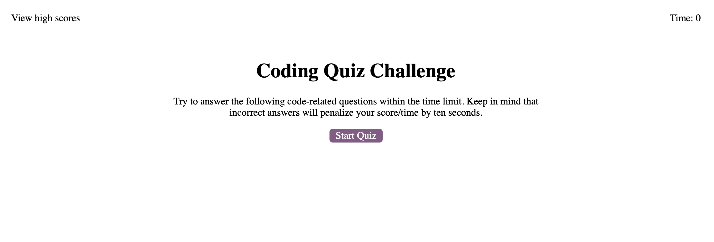
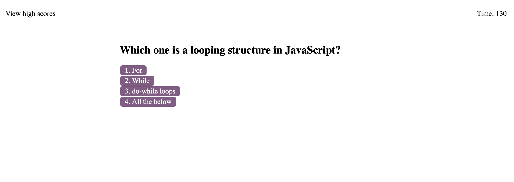
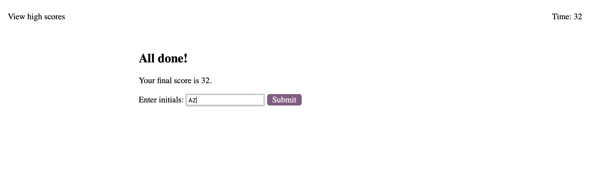

# Code Quiz using Web APIs

Github deployed link: https://alviszheng.github.io/quiz-web-apis/

Build a timed code quiz with multiple-choice questions. This app will run in the browser and feature dynamically updated HTML and CSS powered by your JavaScript code. It will also feature a clean and polished user interface and be responsive, ensuring that it adapts to multiple screen sizes.

## Objective

* Time countdown when the quiz start button is clicked
* Wrong answer will result in penalyt on timer and scrore
* Leaderboard will show all the scores and allow use to clear the scores 

## Codebase

* Index html and a separate page for "leaderboard"
* CSS stylesheet
* Javascript: DOM elements and varaibles

## Github

* Github repository URL: https://github.com/alviszheng/quiz-web-apis

## Project images 

